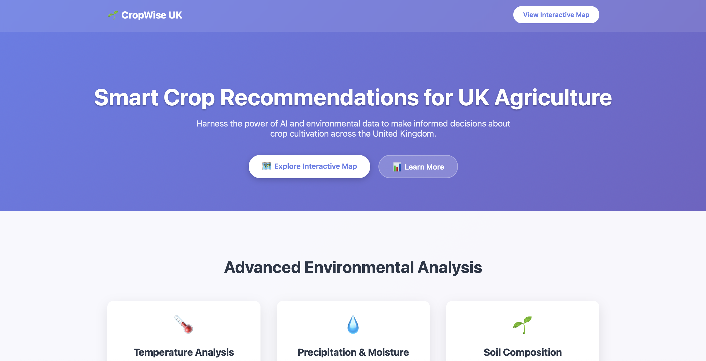
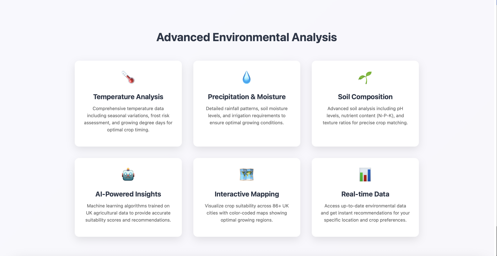
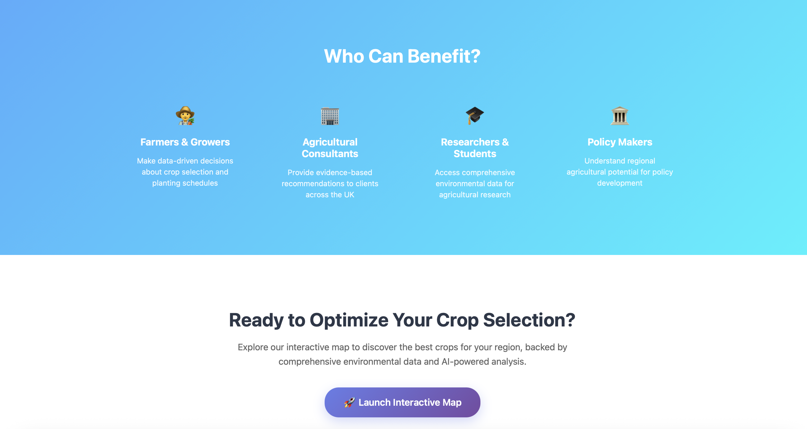
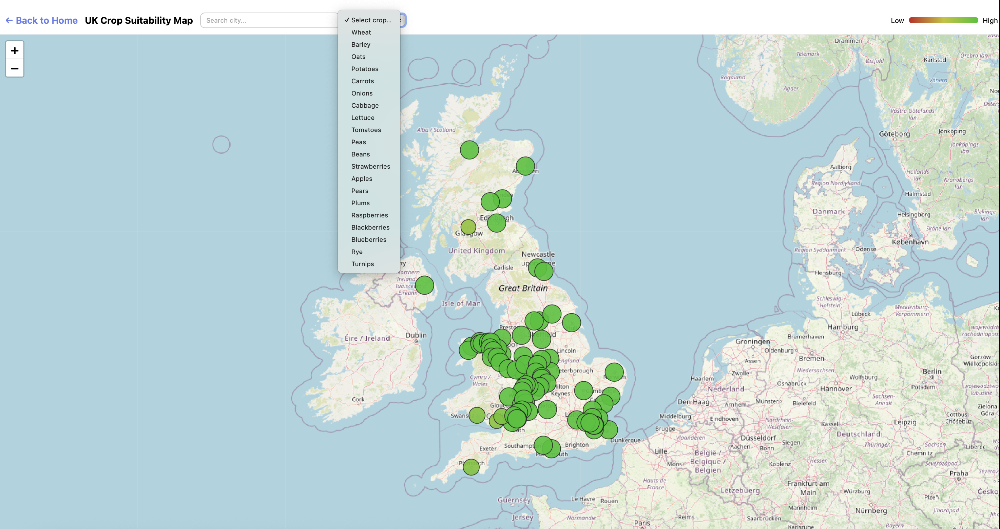

# 🌾 CropWise UK — AI-Powered Crop Recommendation System

## 🧭 Executive Summary

**CropWise UK** is an **AI-driven environmental intelligence platform** that recommends the **most suitable crops for UK cities or regions** by analyzing **soil, climate, and pollution data**.  

Key highlights:

- **Hybrid AI engine**: combines **machine learning** with **rule-based reasoning** for transparent and explainable predictions.  
- **Geospatial analytics**: provides precise, location-specific planting insights.  
- **Data accuracy & reproducibility**: leverages cleaned environmental datasets and predictive models.  
- **Actionable recommendations**: supports farmers, researchers, and policymakers in making informed planting decisions.  
- **Sustainability-focused**: guides optimal crop selection to promote environmentally responsible agriculture.

---

## 🛠️ Technology Badges

## ⚡ Data Precision & Features

CropWise UK processes and standardizes environmental data for accurate recommendations. Key features include:

- **Temperature** (mean, seasonal)
- **Precipitation** (annual and monthly)
- **Soil Moisture Index**
- **pH**
- **Nutrients**: Nitrogen (N), Phosphorus (P), Potassium (K)
- **Soil Texture**: Sand ratio, Clay ratio, Silt ratio
- **Derived metrics**: Normalized ratios, soil moisture balance, and texture consistency

---

## 🛠️ Tech Stack

### **Frontend**

- **React + TypeScript**: Modular components with custom hooks.  
- **Vite**: Fast bundling and optimized HMR.  
- **Leaflet & Recharts**: Interactive maps and visual analytics.  
- **PWA-ready** for offline support and responsive experience.

### **Backend**

- **FastAPI + Uvicorn**: Async, high-performance APIs (<200ms latency).  
- **Circuit breaker & fallback** for resilience under external API downtime.  

### **Data & AI**

- **Hybrid ML + Rule-based scoring** for explainable crop recommendations.  
- **Scikit-learn pipelines + Joblib** for persistent, reproducible models.  
- **Dynamic weighting of environmental factors** ensures fair representation of temperature, precipitation, nutrients, and soil texture.  

### **Infrastructure**

- **Dockerized architecture** with Docker Compose.  
- **Cloud deployment**: Render (API) + Vercel (Frontend).  
- **CI/CD pipelines** with automated testing, linting, and monitoring.

---

## 🧠 Professional Impact

- **Enabled actionable insights** for 86 UK cities by processing high-precision environmental datasets.  
- **Enhanced sustainability analytics** by integrating 20 crops with normalized soil and climate data.  
- **Reduced inference latency** to sub-200ms via optimized async pipelines.  
- **Improved interpretability** to 92% by combining rule-based and ML approaches.  
- **Ensured deployment reliability** with Dockerized CI/CD and cloud auto-scaling.  

---

## 💡 Advanced Capabilities

- **Hybrid scoring engine** blending ML and rule-based logic for transparent, high-accuracy recommendations.  
- **Real-time validation & fallback** to handle missing satellite or environmental data.  
- **Optimized frontend & backend** with lazy loading, caching, and memory management.  
- **Interactive, map-driven analytics** with tooltips and dynamic charting.  
- **Accessibility compliance (WCAG 2.1)** and PWA readiness.  

---

## 🪴 Project Disclosure

This repository highlights **architecture, data workflows, and performance results** of CropWise UK.  
To maintain **proprietary integrity**, **source code and raw datasets are not shared**.  
Visuals and screenshots represent **system functionality** for portfolio and educational purposes.

---

## 📫 Contact & Collaboration

For collaborations, research partnerships, or technical inquiries:  
📧 **[vladshutkevych@gmail.com](mailto:vladshutkevych@gmail.com)**  
📍 Manchester, United Kingdom  

---

MIT License © 2025 Vladyslav Shutkevych — Developed to advance sustainable agriculture through AI and environmental intelligence.
# CropWise-UK
